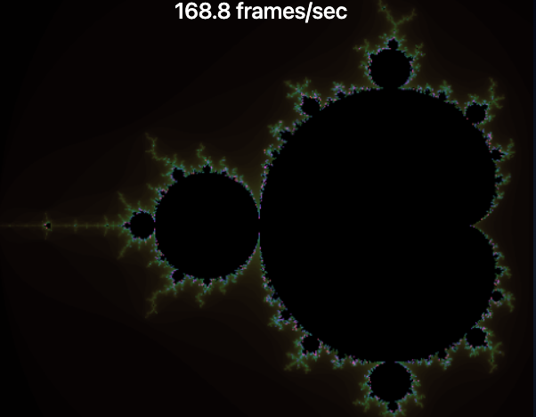

# Demo for web target

This demo shows drawing [Mandelbrot fractal](https://en.wikipedia.org/wiki/Mandelbrot_set) structure on your browsers using the acttey crate.

You can choose CPU workers or GPU to draw the image.



## Prerequisites

Node.js installation

## How to build

```sh
npm install
npm run build-r
```

## How to start server

```sh
npm run start
```

Then you can see an URL on your terminal.

## Try docker

There's a docker image you can try in [docker hub](https://hub.docker.com).

```sh
docker run --rm -p 8080:8080 ecoricemon/acttey-example
```

Then, visit http://localhost:8080 on your browser.
